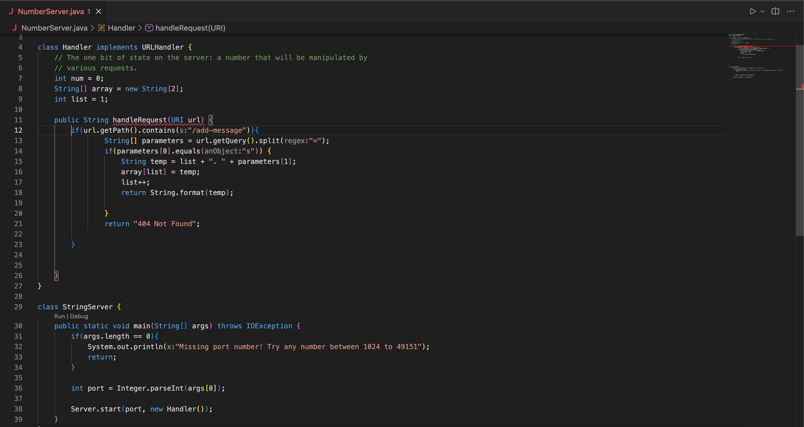
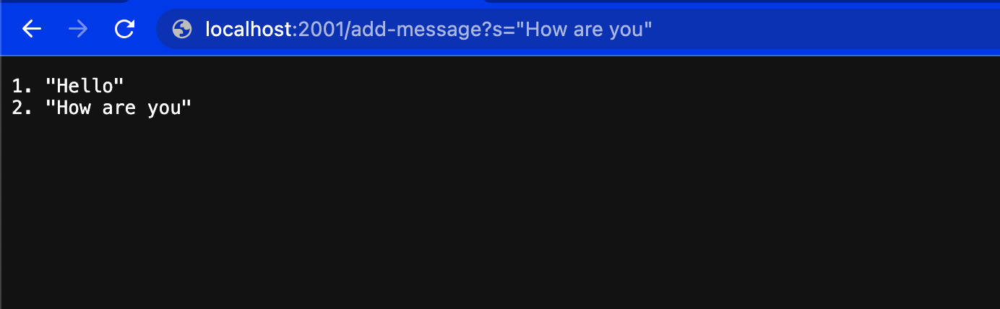
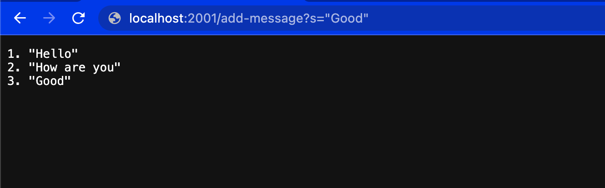
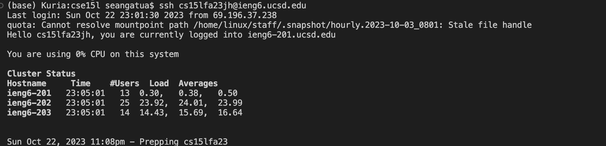

Sean Gatua

The only method called is handleRequest
The only argument passed to handleRequest is a URI object, in this case "url".
The values don't change because the handleRequest only gets passed a URI object which is a static value

The only method called is handleRequest
The only argument passed to handleRequest is a URI object, in this case "url".
The values don't change because the handleRequest only gets passed a URI object which is a static value

