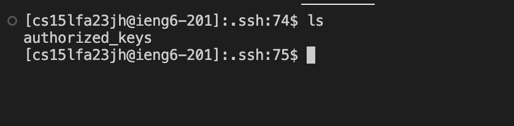

Sean Gatua

The only method called is handleRequest
The only argument passed to handleRequest is a URI object, in this case "url".
The values don't change because the handleRequest only gets passed a URI object which is a static value

The only method called is handleRequest
The only argument passed to handleRequest is a URI object, in this case "url".
The values don't change because the handleRequest only gets passed a URI object which is a static value

I learned new commands: scp and mkdir. The scp command copies files or directories between local and remote systems or between two remote systems. The mkdir command makes a brand new directory. I learned how to adjust the new queries on servinng a webiste, from "add", "add-message", "increment". The git clone method has been incredibly effective when it comes to downloading the files from wavelet.

