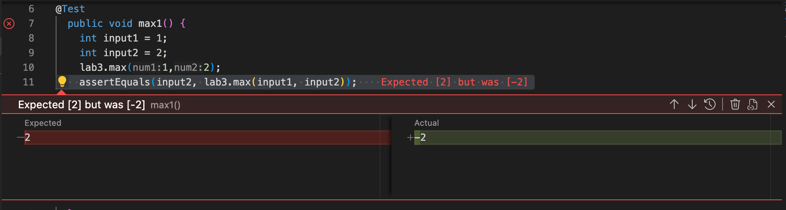
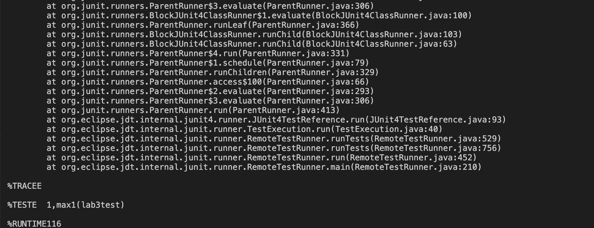
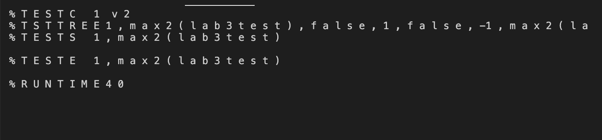
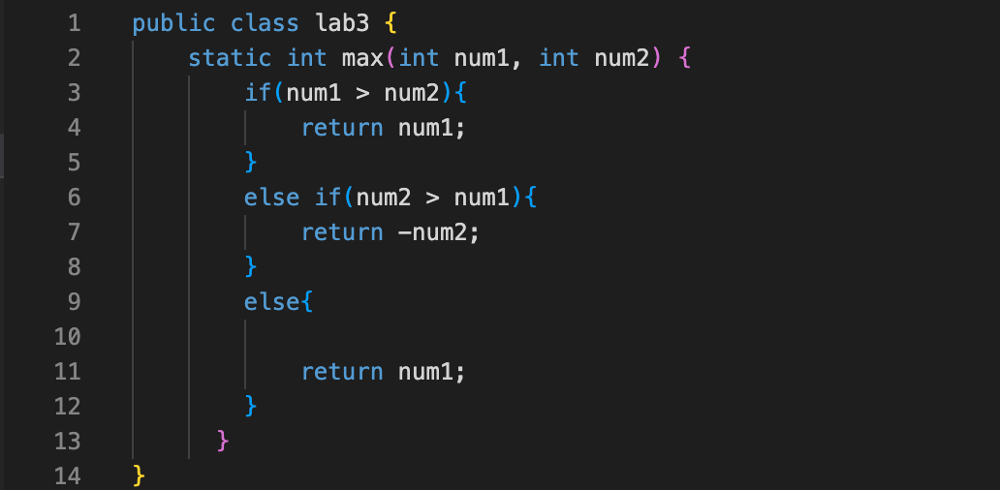
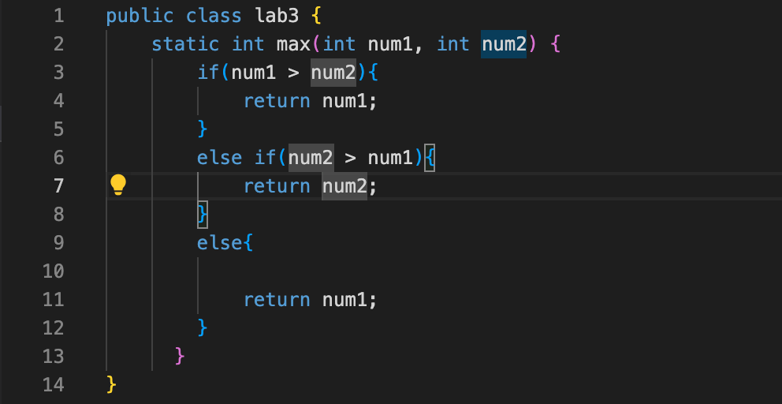

**PART 1**

**Failure Inducing Input**

    @Test
    public void max1() {
      int input1 = 1;
      int input2 = 2;
      lab3.max(1,2);
      assertEquals(input2, lab3.max(input1, input2));
    }

**Resulted Symptom**

**Associated Code**

    public class lab3 {
        static int max(int num1, int num2) {
            if(num1 > num2){
                return num1;
            }
            else if(num2 > num1){
                return -num2;
            }
            else{
               return num1;
           }
         }
    }
**Successful Code**

        @Test
        public void max2() {
          int input1 = 2;
          int input2 = 1;
          lab3.max(input1, input2);
          assertEquals(input1, lab3.max(input1, input2));
      }

**Resulted Symptom**

**Associated Code**

    public class lab3 {
      static int max(int num1, int num2) {
        if(num1 > num2){
            return num1;
        }
        else if(num2 > num1){
            return -num2;
        }
        else{
            return num1;
        }
      }
    }
    
**Buggy Code**

**Correct Code**

**WHY THE ISSUE IS FIXED**

The removal of the - sign in the second conditional provides that num2 will be larger than num1, because if the - sign remained, num2 will always be less than num1

**PART 2**

    grep

1. -l command line option lists filenames only (no directories)
2. -r command line option searches recursively for a string in every directories
3. -i command line option ignores case sensitivities for all strings
4. -c command line option returns the number of times a string matches in other files

5.     find ../docsearch/ -name "*.txt"
**OUTPUT**

        ../docsearch//technical/biomed/1471-230X-2-17.txt
        ../docsearch//technical/biomed/1477-5956-1-1.txt
        ../docsearch//technical/biomed/1471-2156-4-9.txt
        ../docsearch//technical/biomed/1471-2431-2-12.txt
        ../docsearch//technical/biomed/ar328.txt
        ../docsearch//technical/biomed/1471-2210-3-1.txt
        ../docsearch//technical/biomed/1471-2121-4-5.txt
        ../docsearch//technical/biomed/1471-2350-2-8.txt
        ../docsearch//technical/biomed/1471-2202-3-17.txt
        ../docsearch//technical/biomed/1471-2407-1-13.txt
        ../docsearch//technical/biomed/bcr605.txt
        ../docsearch//technical/biomed/1476-069X-2-9.txt
        ../docsearch//technical/biomed/1478-1336-1-3.txt
        ../docsearch//technical/biomed/1471-2164-2-4.txt
        ../docsearch//technical/biomed/1471-2210-1-3.txt
        ../docsearch//technical/biomed/1476-9433-1-3.txt
        ../docsearch//technical/biomed/1471-2334-1-13.txt

Allows for the efficient searching of .txt files

6.     find ../docsearch/ -name "*.sh"

**OUTPUT**

        ../docsearch//count-txts.sh

Allows for the efficient searching of .sh files

7.     find ../docsearch/ -name "*.java"
**OUTPUT**

    ../docsearch//DocSearchServer.java
    ../docsearch//Server.java
    ../docsearch//TestDocSearch.java

Allows for the efficient searching of .java files

8.    find ../docsearch/ -name "*.md"

**OUTPUT**

    ../docsearch//README.md
    
Allows for the efficient searching of .md files

**CITED SOURCE**
**
grep command in Unix/Linux**
https://www.geeksforgeeks.org/grep-command-in-unixlinux/
