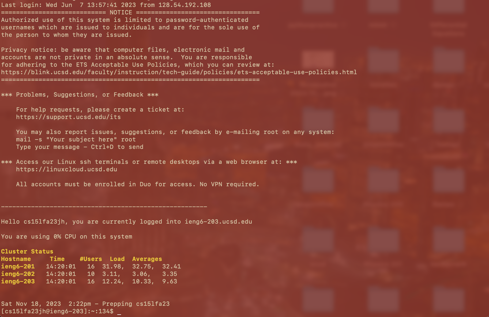
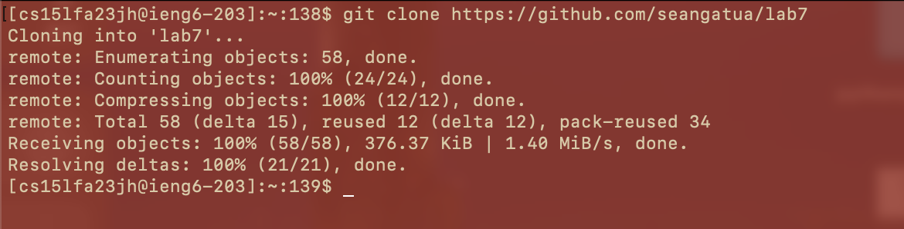
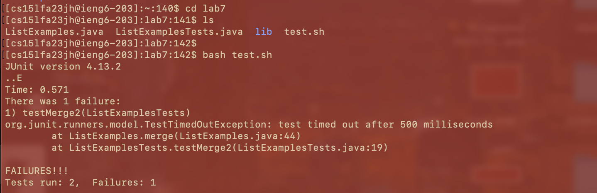
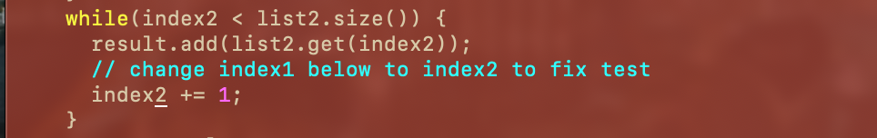
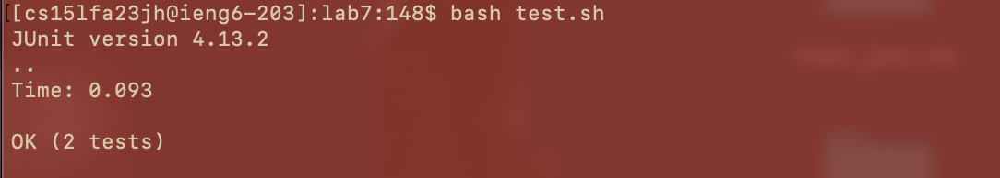
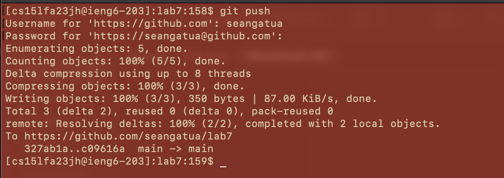

**SEAN GATUA**

Step 1-3 completed

**STEP 4**

    CTRL-R "ssh" <enter>\
    "ssh cs15lfa23jh@ieng6.ucsd.edu" into terminal
this command was gotten from the CTRL-R shortcut to enter ieng6

**STEP 5**

    CTRL-R "clone" <enter>\
    "git clone https://github.com/seangatua/lab7" into terminal
git clone was used from the CTRL-R shortcut to copy the remote repository into my local repository

**STEP 6**

    CTRL-R "cd l" <enter>
    cd lab7 into terminal\
    typed ls into terminal <enter>\
    CTRL-R "bash" <enter>\
    bash test.sh in terminal
the first command was used from the CTRL-R shortcut to enter the lab7 directory\ 
ls was to see if there was a possible bash script to be run\
bash test.sh was used from the CTRL-R shortcut to see if the tests failed

**STEP 7**

    CTRl-R "vim" <enter>\
    vim ListExamples.java in terminal\
    "i" to enter INSERT MODE, used the cursor to find index1 <BACKSPACE> <2> <ESC> to changed index1 --> index2\
    typed :wq to save and quit

the first command was obtained from the CTRL-R shortcut to enter the .java file needed to be changed\
"i" was to be able to change the wrong code, :wq was to save and quit

**STEP 8**

    CTRL-R "bash"\
    bash test.sh in terminal
bash test.sh was to see if the code had been successfully changed and the tests ran as expected

**STEP 9**

    CTRL-R "add" <enter>
    "git add ." in terminal\
    CTRL-R "commit" <enter>\
    git commit in terminal\
    --included a little commit message--\
    CTRL-R "push" <enter>\
    git push in terminal
git add . was used from the CTRL-R shortcut to stage the changed .java file/
git commit was used from the CTRL-R shortcut to move staged files --> local repository\
git push was used from the CTRL-R shortcut to move files from local repository --> remote repository

