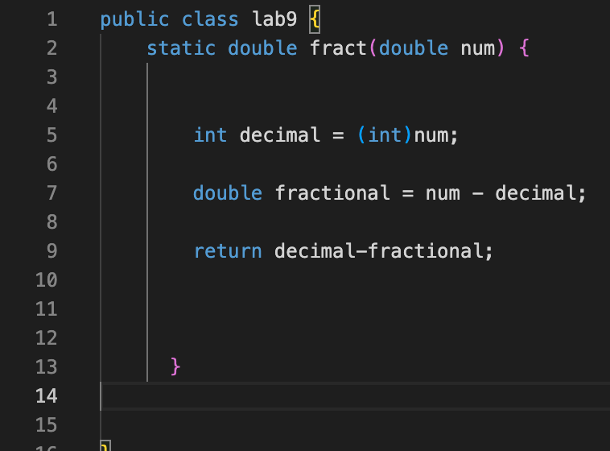

**SEAN GATUA**

**INITIAL ERROR**

I had a question about my code. I'm trying to write a program that returns the fractional part of a decimal. Right now, my tests are failing and I've rechecked my code multiple times and still can't understand why this is happening.

Hi, have you tried using print statements for your original function? Or possibly tried jdb to see what is happening underneath the hood?

**COMMAND LINE OUTPUTS**

Instead of returning the fractional portion, I've programmed the function to return the difference of decimal portion and the fractional.\
That is why the function returns a double value with a whole digit instead of a double value less than or equal to 0.\

DIRECTORY: ~/Documents/GitHub/week9/lab9test.java\
JAVA FILE: ~/lab9test.java\
BASH SCRIPT: ~/test.sh\

**FIXING ERROR**

Fix needed to make was changing the return value to\

    return fractional;
    
  instead of
  
    return decimal-fractional;

**PRE-FIX FILES**

File With Function\
\

Test(s) File\
\

**POST-FIX FILES**

File With Function\
\

Test(s) File\
\

\\\\\

**REFLECTION**

The thing I enjoyed was the use of a debugger using the command line through the jdb <filename> command. I was always of the impression that I needed to have an IDE available and have the necessary extentions downloaded to thoroughly parse through my program, searching for errors. All jdb requires is setting a breakpoint where you want the program to stop running at, and call "locals" which will display the variables in that scope and their values. Additionally, using other commands withing jdb such as step, allows for accessing functions by peeking under the hood to what is happening when I pass a value or reference and how it is being modified. This includes what is returned as a result of my function considering if it isn't void.

